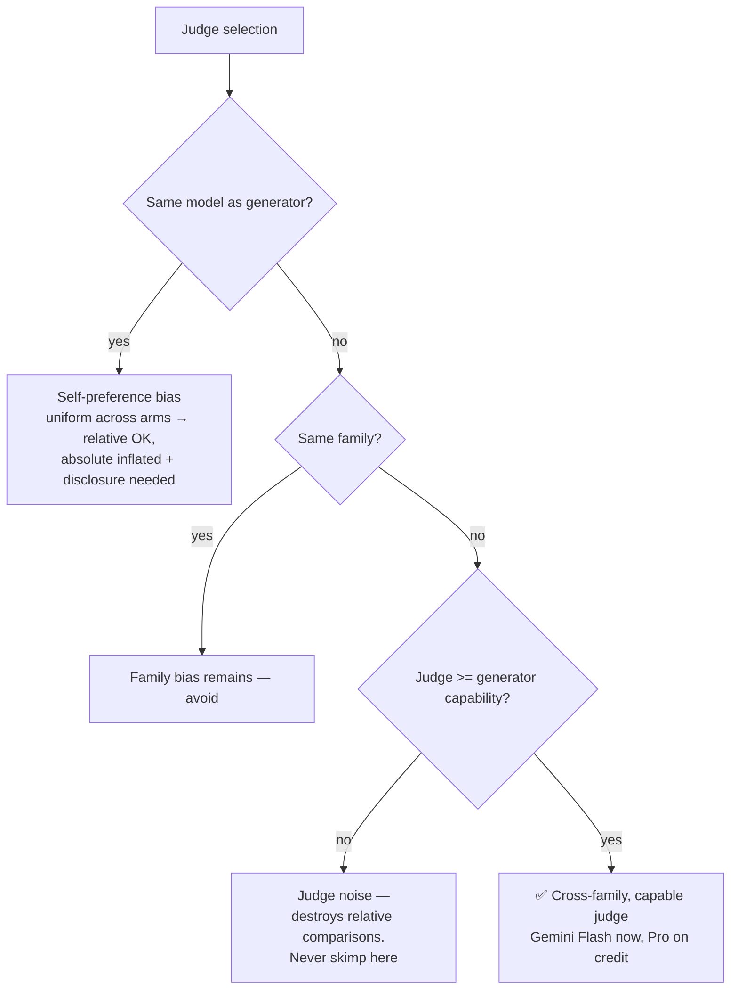
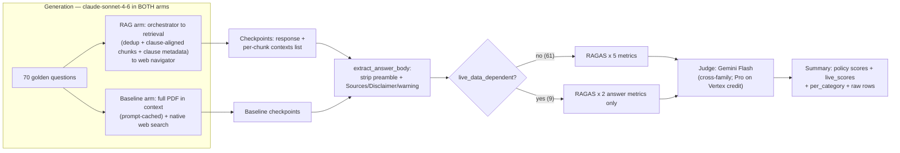

# RAGAS Metrics Improvement — Interventions, Decisions & Rationale

**Project:** HealthInsuranceBuddy — Agentic RAG for Indian health-insurance policy Q&A
**Scope of this document:** the full diagnosis → intervention → review → decision trail for improving four RAGAS metrics (Faithfulness, Context Precision, Context Recall, Answer Relevancy), including model-selection, cost, and latency decisions, and an explicit register of what was deferred or rejected.
**Process note:** interventions were proposed by an AI analysis pass over the eval results and codebase; each was then implemented (by me or by the assistant), independently reviewed against real data, and accepted / modified / declined as recorded below.

---

## 1. Starting point — why this work happened

Baseline eval (70 golden questions × 4 retrieval modes, Claude Haiku generator, Claude Haiku RAGAS judge, run 2026-05-14):

| Mode | Faithfulness | Context Precision | Context Recall | Answer Relevancy |
|---|---|---|---|---|
| dense | 0.622 | 0.768 | 0.610 | 0.472 |
| hybrid | 0.585 | 0.647 | 0.552 | 0.471 |
| dense_rerank | 0.631 | 0.676 | 0.544 | 0.445 |
| **hybrid_rerank** (prod default) | 0.607 | 0.735 | 0.528 | 0.498 |

Two statistical red flags indicated the numbers were partly **measurement artifacts**, not just system quality:
- Context Precision/Recall were **bimodal** — almost every row scored exactly 0.0 or ~1.0.
- 15–20% of Answer Relevancy rows were **exactly 0.0**.

---

## 2. Diagnosis — evidence gathered before any change

| # | Failure pattern | Evidence (measured, not assumed) | Metrics poisoned |
|---|---|---|---|
| D1 | RAGAS `contexts` passed as ONE concatenated blob | `run_eval.py` joined 5 chunks with `" \| "` into a single-element list → per-chunk precision degenerates to a coin flip | Precision, Recall |
| D2 | Duplicate chunks in retrieval | 21–52 of 70 rows per mode contained duplicates (same clause indexed twice via `33.0` vs `"33"` page labels) — up to 40% of the top-5 budget wasted | Precision, Recall |
| D3 | Empty clause metadata | 68–69 of 70 contexts showed `Clause: <empty>` — regex required a literal "Clause/Section" prefix; the policy uses bare `3.2.18`-style numbering → LLM invented citations | Faithfulness, Precision |
| D4 | Chunks cut mid-clause | Token-count-only splitting (128-token leaves) bisected clauses (e.g. *"…the Company shall waive o"*) → model filled gaps from general knowledge | Faithfulness, Recall |
| D5 | Output-contract violations | 21–24 of 70 answers per mode leaked reasoning preamble before `**Verdict:` despite an explicit constraint | Relevancy, Faithfulness |
| D6 | Boilerplate scored as answer | Sources/Disclaimer/helpline text diluted RAGAS's reverse-generated questions → the exact-0.0 relevancy rows | Relevancy |
| D7 | Hallucinated "typical" figures | e.g. *"commonly 36 months"* PED wait stated when the actual clause wasn't retrieved | Faithfulness |
| D8 | Live-data questions structurally ungradeable | 9/70 questions answered from `search_web`, but web content never entered `contexts` → guaranteed ~0 on context metrics | Precision, Recall, Faithfulness |
| D9 | Weak, self-judging evaluator | Haiku generated AND judged (worst case for self-preference bias + judge noise) | All (noise) |

Golden-dataset profile that shaped decisions: 70 questions; **58/70 ground truths span multiple clauses** (recall pressure at top_k=5); **32/70 hinge on a specific number** (hallucination pressure); 10 adversarial/vague; 9 live-data-dependent.

---

## 3. Intervention register

Ten interventions were proposed and ranked. Disposition of every one:

| # | Intervention | Target metrics | Rationale | Disposition |
|---|---|---|---|---|
| 1 | Pass contexts to RAGAS as a per-chunk **list**, not a blob | Precision, Recall | RAGAS scores each list element; one element = binary metric | ✅ **Done** (me) — reviewed, hardened |
| 2 | Re-ingest + exact-text **dedup** at retrieval | Precision, Recall | Duplicates ate 20–40% of top-5 slots | ✅ **Done** (me) — reviewed |
| 3 | Fix **clause-metadata extraction** (bare `3.2.18`-style numbers) | Faithfulness, Precision | Citations can't be grounded if metadata is empty | ✅ **Done** (me) — review found a real bug, fixed (see §4) |
| 4 | **Clause-aligned chunk boundaries** before tokenization | Faithfulness, Recall | Truncated clauses force gap-filling; ground truth split across vectors | ✅ **Done** (me) — reviewed clean |
| 5 | Enforce the `**Verdict:` **output contract** | Relevancy, Faithfulness | ~30% of answers leaked unsourced preamble | ✅ **Done** (me, eval-side strip) — kept generation path untouched |
| 6 | **Strip boilerplate** before RAGAS scoring | Relevancy | Disclaimer/Sources diluted relevancy embedding; caused 0.0 rows | ✅ **Done** (me) — review found a gap, patched (see §4) |
| 7 | **Query rewriting / decomposition** before retrieval | Recall, Precision | Colloquial/Hinglish queries embed poorly; multi-hop questions need >1 query | ⏸️ **Declined for now** (my call — see §5) |
| 8 | Raise **top_k 5→8** post-rerank | Recall | 58/70 ground truths span multiple clauses | ⏸️ **Deferred** (joint call — see §5) |
| 9 | **Grounding fixes** (dataset + prompt), split into 9a–9f | Faithfulness, Relevancy | Several distinct hazards — see §6 | ✅ Partially done, partially "ignore by design" |
| 10 | **Model/judge separation** + judge upgrade | Measurement fidelity | Haiku-judging-Haiku = max self-bias + max noise | ✅ **Done** — after a multi-round debate (see §7) |

---

## 4. Implementation & review trail (interventions 1–6)

Each fix was implemented, then independently reviewed against real data. What the reviews caught matters as much as the fixes:

| Fix | Implementation | Review verdict | Modifications that came out of review |
|---|---|---|---|
| 1 — contexts list | Split `result_full` on `\n---\n`; checkpoints store both list + joined string; back-compat for old checkpoints | ✅ Sound. Verified separator matches orchestrator's joiner; verified **0 of 505/668 indexed chunks contain an embedded `---` line** (the parsed MD has 86 such lines — checked because it could over-fragment) | Hardening adopted: orchestrator now logs `result_chunks` (a real list) so the eval never re-splits a joined string |
| 2 — dedup + re-ingest | `_deduplicate()` after `auto_merge`; namespace wiped and re-ingested (477 clean leaf nodes, 0 page-label dupes) | ✅ Sound | Noted (deferred): dedup drops without backfilling → occasionally <5 chunks; fold "rerank top_n = top_k + 2, cut after dedup" into the future top_k work |
| 3 — bare clause numbers | `BARE_CLAUSE_RE` (≥2 dotted components) as fallback after the prefix pattern | ⚠️ **Real bug found**: prefix pattern ran *first* and matched body cross-references — **12/124 chunks got the WRONG clause number** (e.g. heading `3.1.1` tagged as `4.2` from "Section 4.2" in the body; "Schedule is" captured `i`). Wrong-with-confidence is worse than empty | Fixed: heading-anchored match at chunk start wins; `\b` added to the prefix pattern. Re-verified: **0 mismatches / 124 chunks**. Required re-ingestion (metadata lives in the index) |
| 4 — clause-boundary pre-split | `CLAUSE_BOUNDARY_RE` splits pages on clause headings before `HierarchicalNodeParser`; <80-char orphan headings dropped | ✅ Sound. Stress-tested on the full policy: 129 boundaries, **0 false splits** on decimal values ("1.5 lakh", "2.5%"); only 183 chars dropped | Minor accepted loss: one short definition clause (2.2.7 "Company") falls under the 80-char floor — logged as a known gap, not worth a merge mechanism for one clause |
| 5 — verdict contract | Eval-side post-processing (strip pre-`**Verdict:` text) rather than assistant prefill — avoids touching LlamaIndex's generation path | ✅ Sound; regex extended to catch the `**Verdict**:` bolding variant | — |
| 6 — boilerplate strip | Strip from `\n**Sources:` onward, eval-only; UI output untouched | ⚠️ **Gap found**: answers with a Disclaimer but *no* Sources block (exactly the noncommittal answers driving relevancy=0) weren't stripped | Fixed: cut at the first of `**Sources` / `**Disclaimer` / `⚠️` markers; tested against synthetic cases built from real response patterns |

**Takeaway for the write-up:** the review pass caught two defects (fix 3 precedence, fix 6 marker set) that would each have silently *worsened* the metric they were meant to improve.

---

## 5. Interventions I pushed back on — and what we agreed

### Intervention 7 — Query rewriting: DECLINED (for now)
- **My objection:** an LLM reinventing the query and fanning out to multiple searches risks off-intent retrieval ("nonsense") and adds latency.
- **Agreed position:** objection valid; multi-query fan-out is the risky variant. If ever revisited, the low-risk shape is a **single conditional rewrite** — only when the reranker's top score falls below a threshold, canonicalize once and retry. Deterministic trigger, one extra call, only on already-failing queries. **Not built until post-fix recall numbers justify it.**

### Intervention 8 — top_k 5→8: DEFERRED
- **My question:** must it be in the first batch, or can it wait (cost)?
- **Agreed position:** wait. It's a one-line env change with nothing to lose by deferring; fix 2 (dedup) may recover the effective recall by itself; and after fix 1, **context_precision is judged per chunk, so 5→8 raises judge cost ~60%** on that metric. Trigger condition: recall still low while precision healthy after the re-run.

---

## 6. Grounding problems (9a–9f) — fix vs ignore decisions

| Sub-issue | Evidence | Decision | Implementation |
|---|---|---|---|
| 9a — 9 live-data questions poison context metrics | Web content never enters `contexts` → guaranteed 0s on ~13% of rows | **Fix (cheap, high payoff)** — score in two buckets rather than plumb web content into a metric it wasn't designed for | Eval splits: 61 policy questions × 5 metrics; 9 live questions × answer metrics only; separate `live_scores` in summary + console |
| 9b — 58/70 multi-clause ground truths | Recall ceiling at top_k=5 | **No new work** — already targeted by fixes 2/4 and deferred intervention 8 | Re-measure first |
| 9c — 32/70 number-hinging ground truths | "commonly 36 months" hallucination pattern | **Fix (one prompt line)** | Constraint added: never supply typical/industry values not verbatim in a retrieved chunk; point to Policy Schedule |
| 9d — few-shot example contains realistic citations | Haiku parroted example clause numbers into unrelated answers | **Fix (prompt edit)** | `<example_note>` added: example citations are illustrative; never cite anything not in retrieved chunks/web content |
| 9e — adversarial questions score low relevancy | Correct hedging on 10 adversarial questions *should* score low — the metric working as designed | **Ignore the score; fix the reporting** | `per_category` means added to summary JSON so the adversarial bucket can't mask regressions elsewhere |
| 9f — forced Yes/No/Partial verdict encourages guessing | Schema demands a committed first token | **Fix (one line)** | Constraint rewritten: insufficient evidence → `**Verdict: Partial**` + name the missing clause; never guess Yes/No |

---

## 7. Model selection — the debate, round by round

This was the most contested decision. Recording the full trail because each reversal had a real rationale:

| Round | Proposal | Challenge | Outcome |
|---|---|---|---|
| 1 | Keep Haiku generator; judge → Gemini 2.5 Flash (cross-vendor, cheap) | — | Provisional |
| 2 | — | **Me:** "Sonnet baseline vs Haiku RAG is a wrong comparison!" — confounds model capability with architecture | ✅ Accepted: **same generator in both arms** is non-negotiable. Proposed Haiku in both |
| 3 | Haiku both arms (matches production; cheapest) | **Me:** "Haiku doesn't have reasoning" | Fact-checked via Models API: Haiku 4.5 **does** support extended thinking (not adaptive/effort). But the deeper rule stood either way: capabilities must be **identical across arms** |
| 4 | — | **Me:** orchestration + web navigation are non-trivial; "Haiku will suck." Proposed Sonnet-gen/Gemini-judge OR Gemini-gen/Sonnet-judge | ✅ **Sonnet generation** chosen — and it's the *lower-effort* path: the agent layer is Anthropic/LlamaIndex-native (Gemini generation = rewrite + re-tune), and judge cost recurs far more than generator cost |
| 5 | Judge = Gemini 2.5 Flash | **Me:** "Judge cannot be cheap!" | ✅ Upgraded to **Gemini 2.5 Pro** — judge ≥ generator, cross-family, ~$15–25/run |
| 6 | — | **Me:** want to use **free-tier** Gemini | Reality check: free-tier Pro ≈ 50–100 requests/day vs ~3,500–5,000 judge calls per run → **35–50 days**. Not viable. Paths: GCP $300 trial credits (Pro, $0) or paid Flash (~$3–5/run) |
| 7 | "Can gen and eval be the same model?" | Researched online | Self-preference bias is real and strongest for same-family judges on style-sensitive metrics; **but** with ONE generator in all arms, bias applies uniformly → relative comparisons stay valid. "Sonnet both" = acceptable-with-disclosure, though the *most expensive* judge option (~$50–60/run) |
| 8 | "Haiku everywhere then?" | — | ❌ **Rejected** — the one config worse than the start: weak generator (already rejected) + **noisy** judge. Uniform bias cancels between arms; judge **noise doesn't** — it destroys the relative comparisons that are the whole point |
| 9 | GCP credit investigation | Console screenshots + billing CSV | $300 Free Trial: **expired** (Mar–Jun 2025). Found a live **"Trial credit for GenAI App Builder": ₹94,812, 100% remaining, valid to 2027-04-26** — scope ambiguous ("see promotion terms"). Devised an empirical test: run a few Gemini prompts via Vertex AI Studio, check next day whether the credit's remaining value drops |
| 10 | **FINAL** | — | **Generator: `claude-sonnet-4-6` in both arms, no extended thinking. Judge: Gemini Flash (paid, wired) — with a standing upgrade to Gemini Pro via Vertex if the credit test passes.** Cohere embeddings/rerank unchanged (embeddings aren't a judge; rerank isn't an LLM concern) |

### Final decision matrix (generator × judge)

| Config | Relative comparisons | Absolute scores | Judge cost/run | Verdict |
|---|---|---|---|---|
| Haiku gen + Haiku judge | ❌ noisy | ❌ noisy + self-biased | ~$10 | Original setup — ruled out |
| Sonnet gen + Sonnet judge | ✅ valid (uniform bias) | ⚠️ inflated; needs disclosure | ~$50–60 | Acceptable fallback |
| **Sonnet gen + Gemini Flash judge** | ✅ valid | ✅ mostly clean | ~$3–5 | **Chosen (wired)** |
| Sonnet gen + Gemini Pro judge | ✅ valid | ✅ clean | ~$20–35 (→ $0 on credit) | Upgrade path if credit test passes |

**Key principle that settled it:** *generation quality is what you measure; judge quality is the instrument.* You may economize on the thing being measured (that's just an honest finding) — economizing on the instrument corrupts every finding.

---

## 8. Cost & latency decisions

### Cost estimate (one full eval pass, final config)

| Step | Billed | Estimate |
|---|---|---|
| Re-ingest (cached parse; no LlamaParse) | Cohere embeds ~505 chunks + Pinecone writes | < $1 |
| RAG-arm generation (280 runs, Sonnet) | ~8K in / ~0.8K out per run | ~$8–15 |
| Baseline generation (70 runs, full PDF) | ~60–80K tokens/call | ~$15–20 → **~$4–6 with prompt caching** |
| RAGAS judging (~350 rows × 10–15 calls) | Gemini Flash | ~$3–5 (Pro on credit: $0) |
| Cohere rerank + eval embeddings | ~280 searches | < $1 |
| **Total** | | **~$20–30 per full pass** |

### Cost optimizations adopted
1. **Prompt caching** on the baseline's PDF block (`cache_control: ephemeral`) — 70 requests share the prefix, ~75% off baseline input.
2. **Smoke-test protocol**: run `--modes hybrid_rerank` alone (~$2–3 + judging) and sanity-check outputs before spending on the other three modes.
3. **Judging is NOT checkpointed** — checkpoints cache generation only; every eval invocation re-pays the full judge bill. Documented so re-runs aren't casual.
4. Defer top_k=8 (judge cost +~60% on precision) until data demands it.
5. Judge on the cheapest *credible* tier (Flash), with a free upgrade path (Vertex credit → Pro).

### Latency considerations
- Moving generation Haiku → Sonnet raises the ~18s average query latency; accepted as a product trade-off for orchestration quality (an explicit decision, not an oversight).
- Query rewriting was declined **partly on latency grounds** (extra LLM call per query).
- Retrieval itself (~3s of the ~18s) was untouched; dedup and clause-aligned chunks are latency-neutral.
- Sonnet follows the `**Verdict:` contract better than Haiku → less preamble to strip, slightly shorter outputs expected.

---

## 9. Not done / postponed — the honest backlog

| Item | Why postponed | Trigger to revisit |
|---|---|---|
| top_k 5→8 (+ candidate_k 20→30, rerank top_n = top_k+2 with post-dedup cut) | One-line change; costs judge $ and generator tokens; dedup may suffice | Post-re-run: context_recall still low **while** precision healthy |
| Query rewriting (single conditional rewrite) | Latency + off-intent risk; recall may already be fixed | Recall stuck after top_k=8 |
| Multilingual embeddings (`embed-multilingual-v3.0`) for Hinglish queries | Requires re-embed + re-index; unproven need | Per-category scores show colloquial/Hinglish questions lagging |
| Web content into RAGAS `contexts` for live-data questions | Split-reporting chosen instead — metrics stay honest without plumbing | Only if live-data faithfulness ever needs formal grading |
| Panel-of-judges (Gemini + GPT-class, averaged) | Gold-plated best practice; 2× judge cost for second-order gain | Noted as a known upgrade in the write-up; not for a personal project now |
| Merge <80-char chunks instead of dropping (recovers clause 2.2.7 "Company") | 183 chars total at stake; one short definition | If a golden question ever hits that clause |
| Gemini Pro judge via Vertex AI (GCP GenAI App Builder credit, ₹94,812 to 2027-04-26) | Credit scope ambiguous; empirical test devised (run Vertex prompts → check if credit's remaining value drops next day) | Test passes → swap `ChatGoogleGenerativeAI` for `ChatVertexAI`, re-baseline once |
| Assistant-prefill enforcement of `**Verdict:` in generation | Eval-side strip chosen; prefill is awkward inside LlamaIndex AgentWorkflow (and Sonnet complies better anyway) | Only if Sonnet still violates the contract materially |

---

## 10. Final execution checklist (as handed to the executing agent)

1. **Re-ingest** `care-insurance-sample` from the cached parse (index predates the clause-metadata precedence fix; ~10% of chunks tagged wrong). Verify ~505 leaf nodes, no duplicate texts, zero sub_clause/heading mismatches.
2. **Model alignment + judge swap** — `claude-sonnet-4-6` in orchestrator, web navigator, and baseline (identical string, no thinking config); Gemini judge in both eval scripts (Flash wired; Pro-on-Vertex if the credit test passes); Sonnet pricing in cost math; `cache_control` on the baseline PDF block; delete the stale baseline checkpoint. *(Status: wired.)*
3. **Fresh eval** — `--fresh` smoke test on `hybrid_rerank` (verify: policy table = 5 metrics × 61 q; live-data line = 2 metrics × 9 q; `per_category` in summary; responses start `**Verdict:`; contexts are 5 distinct chunks with populated `Clause:`), then remaining modes + baseline. **Treat the run as the new baseline — never compare to pre-fix scores** (different judge, prompts, and index).

---

## Appendix — evaluation architecture after all interventions

*Sources consulted for the judge-separation decision: arXiv 2508.06709 (self-bias measurement), arXiv 2604.22891 (self-preference quantification), W&B and Braintrust LLM-as-judge guides, Arena-Hard pipeline (2406.11939).*
